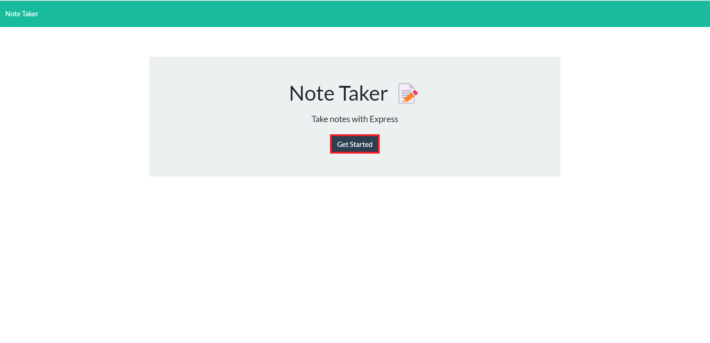
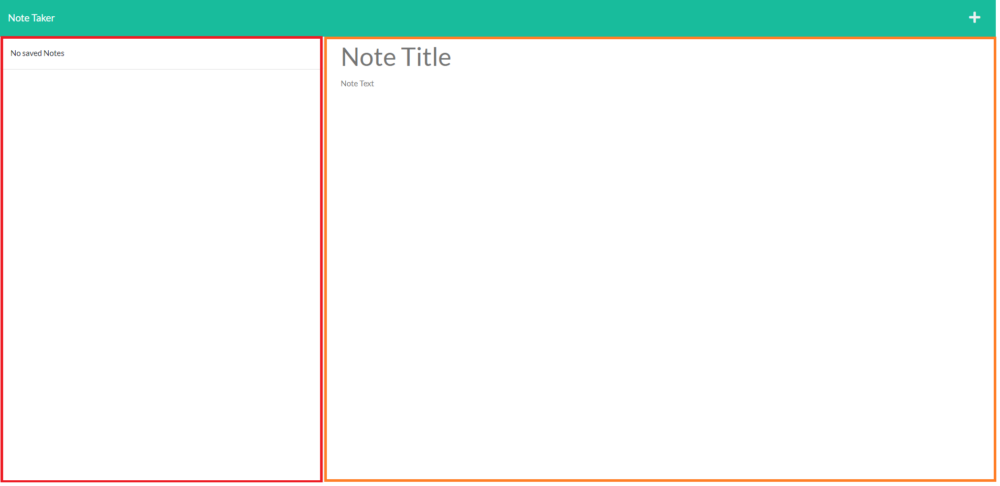
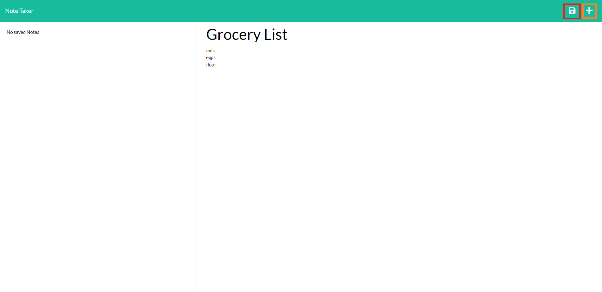

# Note_Taker
## Description

The goal of this assignment was to write the code to handle the GET requests for changing pages, the GET request for displaying previous notes saved to db.json file and the POST request to save new notes to the db.json file and display the note. Previously saved note have an id (unlike initial example data) so that when clicked the details of the note can be displayed.

## Live Deployment link

The live deployment of the site can be found at: https://note-taker-pletzjd.herokuapp.com/

## Usage

When loading website the user is taken to an initial landing page. They can click the get started button (highlighted in red below) which takes them to the 'notes' page.

On the 'notes' page the user is shown previously saved notes, if any, on the left (highlighted in red below) and place to fill out new notes on the right (highlighted in orange below).

Once the user has filled in both fields a 'save' button (in the form of a floppy disc icon) appears in the top right of the page (highlighted in red below). Next to this icon is a 'new note' button (in the form of a plus icon highlighted in orange below) which clears the right side of the page so a new note can be written

## Credits

Developper(s):
- Jordan Pletzer: https://github.com/pletzjd

Initial code provided by:
- University of Toronto School of Continuing Studies: https://bootcamp.learn.utoronto.ca/coding/curriculum/

## License

MIT License

Copyright (c) [2022] [Jordan Daniel Joseph Pletzer]

Permission is hereby granted, free of charge, to any person obtaining a copy
of this software and associated documentation files (the "Software"), to deal
in the Software without restriction, including without limitation the rights
to use, copy, modify, merge, publish, distribute, sublicense, and/or sell
copies of the Software, and to permit persons to whom the Software is
furnished to do so, subject to the following conditions:

The above copyright notice and this permission notice shall be included in all
copies or substantial portions of the Software.

THE SOFTWARE IS PROVIDED "AS IS", WITHOUT WARRANTY OF ANY KIND, EXPRESS OR
IMPLIED, INCLUDING BUT NOT LIMITED TO THE WARRANTIES OF MERCHANTABILITY,
FITNESS FOR A PARTICULAR PURPOSE AND NONINFRINGEMENT. IN NO EVENT SHALL THE
AUTHORS OR COPYRIGHT HOLDERS BE LIABLE FOR ANY CLAIM, DAMAGES OR OTHER
LIABILITY, WHETHER IN AN ACTION OF CONTRACT, TORT OR OTHERWISE, ARISING FROM,
OUT OF OR IN CONNECTION WITH THE SOFTWARE OR THE USE OR OTHER DEALINGS IN THE
SOFTWARE.